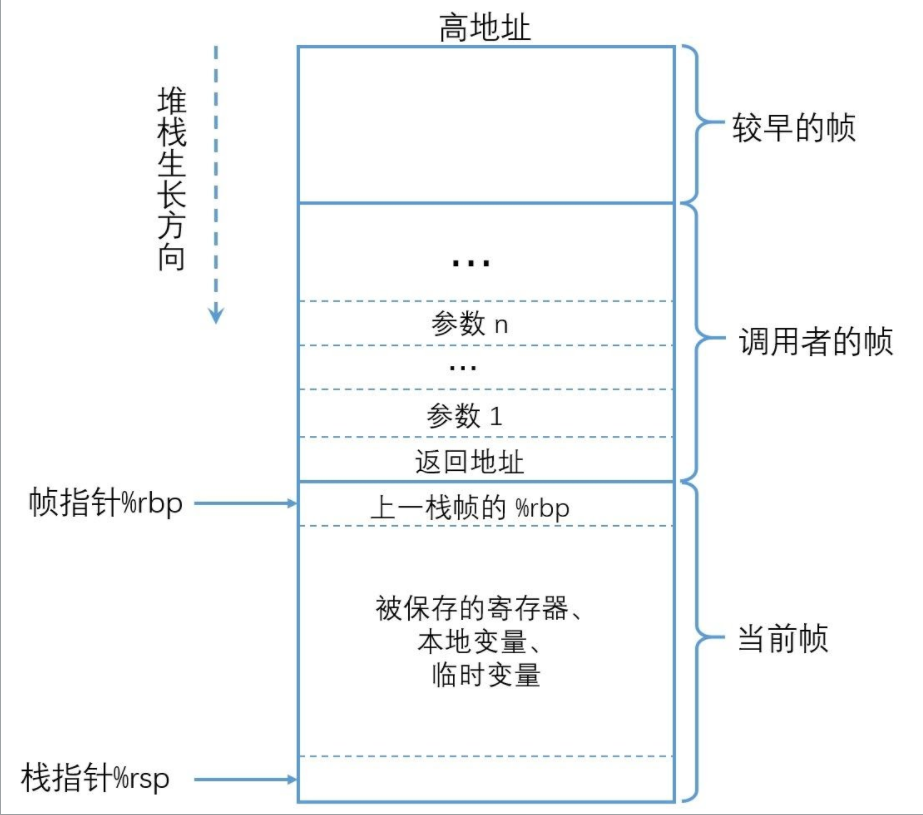

## 协程

#### 1.1 函数的执行环境

函数的执行环境可以分为四个部分：

1. **可执行的二进制代码**：

   - 二进制代码由编译器生成，编译后固定存储在二进制文件的 `.text` 段，加载到内存的只读代码区。理论上，这些代码不可以修改，但在某些情况下可以通过动态指令进行修改，这超出了我们的讨论范围。对于这部分，我们不需要过多关注。程序编译后，代码段加载到内存中，在 x86 的 CPU 平台下由 **EIP 寄存器** 指向下一条指令的内存地址，在 X64 平台是 **RIP 寄存器**，只是 64 位的，本质不变。对于我们的 **协程** 来说，需要手动记录和切换 EIP/RIP 关联的内存地址，具体方法后面会详细说明。

2. **运行所需寄存器**：

   - 寄存器非常重要，是我们学习和编写汇编代码时常打交道的部分。除了普通寄存器，随着 CPU 的升级，各种专用寄存器和指令也应运而生，比如 SSE 指令集使用的 XMM 寄存器，ARM 的 NEON 加速指令等。对于协程，我们只关心三类寄存器：**ESP 和 EBP（操作和记录堆栈相关的寄存器），EAX、EBX、ECX 等通用寄存器（用于操作指令的具体运算、传参、返回等），以及 EIP（控制执行指令的寄存器）**。在 X64 平台上，实际情况差不多，只是多了几个寄存器。协程在离开函数和恢复函数时，需要正确还原原来寄存器的值，但不一定是所有寄存器，根据 Intel i386 的 ABI 调用约定，有些寄存器的值本来就可以改变。

3. **运行所需栈内存**：
   - 函数运行离不开栈内存。简单来说，栈内存包含函数的参数、返回地址、需要保护的寄存器和局部变量。下图展示了经典的函数栈帧结构，其他资料中也有很多示意图。参数不一定都压栈，这取决于调用约定。对于协程，我们需要记录栈内存，比如函数的局部变量修改后，下次调用时需要是修改后的值。这涉及两大主要模式：**有独立栈协程和无独立栈协程**，其他变种暂不讨论。

4. **运行可能所需堆内存**：
   - 函数执行过程中可能需要动态分配一些堆内存，如通过 `new` 或 `malloc` 分配的内存。对于初步理解协程，这部分暂时不需要过多关注。

#### 1.2 函数的传参

##### 1.2.1 函数传参方式

函数的传参可以通过多种方式进行，具体方式取决于调用约定（calling convention）。常见的调用约定包括 `fastcall`、`stdcall`、`cdecl` 等。以下是对这些调用约定和传参方式的详细解释：

1. **纯栈传参**：

   - 所有参数都通过栈传递。这种方式在参数较多时使用较多，因为栈可以容纳任意数量的参数。

2. **寄存器传参**：

   - 在参数较少的情况下，参数可以直接通过寄存器传递。这种方式效率较高，因为寄存器访问速度比栈快。

3. **寄存器加栈传参**：
   - 当参数较多时，部分参数通过寄存器传递，剩余参数通过栈传递。这种方式结合了寄存器和栈的优点。

##### 1.2.2 函数调用约定

不同的调用约定对传参方式和顺序有不同的规定：

1. **`fastcall`**：

   - 参数优先通过寄存器传递，剩余参数通过栈传递。
   - 具体使用哪些寄存器取决于平台和编译器。

2. **`stdcall`**：

   - 参数从右到左压入栈，由被调用者清理栈。
   - 常用于 Windows API 函数。

3. **`cdecl`**：
   - 参数从右到左压入栈，由调用者清理栈。
   - 常用于 C 语言函数。

##### 1.2.3 平台和架构差异

不同平台和架构对寄存器的使用也有所不同：

1. **Windows 32 位平台**：

   - `eax` 常用于返回值。
   - `ecx` 用作 `this` 指针。
   - `edx` 作为第二个参数。

2. **Linux 32 位平台**：

   - 依次使用 `ebx`、`ecx`、`edx` 传递参数。

3. **64 位平台**：

   - 依次使用 `RDI`、`RSI`、`RDX`、`RCX`、`R8`、`R9` 传递参数。

4. **ARM64 平台**：
   - 依次使用 `x0`、`x1`、`x2`...`x7` 传递参数。

#### 1.3 函数的返回值

函数的返回值**一般来说用 `eax`/`rax`/`x0` 作返回，但这不是绝对的**。一个函数也可以借用其他寄存器返回值，如 `edx`、`xmm0`。如果函数返回值是一个结构体，**一个寄存器大小无法返回，可能会把返回值地址作为隐藏的参数传递**。例如，Boost 的协程切换函数就是这样的情况。

从 C/C++ 层面来说，函数调用与返回没有太多花样。我们从汇编层面来看，一般调用使用 `call functionA` 的形式，返回使用 `ret` 的形式。这里面有一些省略和等价过程，这些等价过程对协程非常重要，还需要使用这些知识点，这里还涉及栈的 `push` 与 `pop`，我们有必要详细说明。
